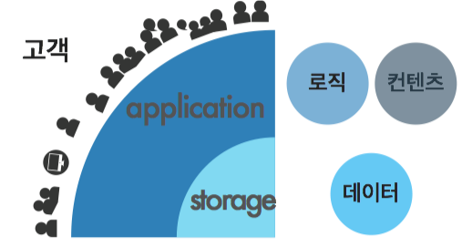
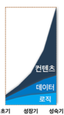
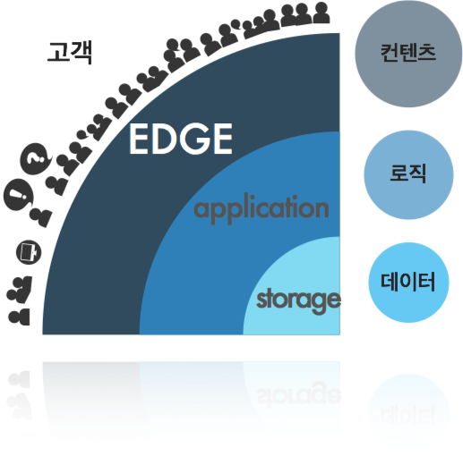
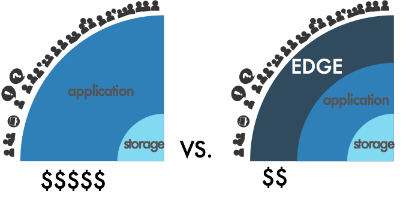

.. _intro:

1장. STON 소개
******************

.. toctree::
   :maxdepth: 2

서비스 설계의 원칙
====================================

서비스의 성공은 가용성, 속도, 확장성에 달려있다. 
“확장성 웹 아키텍처와 분산 시스템 설계 (Scalable Web Architecture and Distributed Systems)”를 저술한 Kate Matsudaira도 
이 원칙들을 강조한다. [#f1]_

가용성 (availability)
---------------------

서비스는 항상 가능해야 한다. 사이트 장애시 90%의 사용자는 경쟁사 서비스로 이동한다. [#f2]_ 
100% 완벽한 시스템은 없다. 그러나 장애가 발생하면 복구는 빨라야 한다. 일부 결함의 전체 영향은 없어야 한다. 

속도 (performance)
---------------------

고객은 인내심이 많지 않다. Akamai의 조사에 따르면 47%의 인터넷 사용자들은 웹페이지가 2초 안에 열리기를 기대한다. [#f3]_ 
비즈니스에서 시간은 금이다. 응답시간이 느리면 매출이 감소한다. Amazon은 응답시간이 0.1초 지연되면 매출 1%가 감소한다. [#f4]_

확장성 (Scalability)
---------------------

확장성은 서비스의 크기만이 아니다. 크기를 키우고 유지하는 노력, 스토리지 확장 용이성, 트랜잭션 처리 여력도 확장성의 일부이다. 관리의 확장성도 고려해야 한다. 진단, 문제 이해, 업데이트와 변경이 쉬워야 한다.

모든 원칙은 최소비용으로 구현되어야 한다. 비용이란 돈뿐만이 아니다. 개발 시간, 운영 노력, 심지어 교육훈련도 비용이다.

Matsudaira는 다음 방법을 제시한다.

* 상호 독립적인 (complementary) 컴포넌트의 구성 시스템 설계

* 비공유 (shared-nothing) 아키텍쳐로 여유도 (redundancy) 설계

* 확장용이한 partitioning 설계

서비스의 성장
==============

서비스에는 서버가 필요하다. 테스트나 파일럿 서비스는 한 대의 서버로 시작한다. 본격적인 서비스는 이중화된 두 대의 서버로 시작해야 안전하다.  서비스가 조금씩 성장한다. 서버 수는 금방 야금야금 늘어난다. 컨텐츠 갱신마다 한 대씩 꼼꼼하게 해야 한다. 손발이 고생할 뿐, 아직까지는 관리에 큰 무리가 없다. 

서비스가 성장하기 시작한다. 매출에도 가속도가 붙기 시작했다. 고객이 늘어났다. 쌓을 데이터가 점점 커진다. 서버들을 일일이 관리하는 것도 어려워진다. 데이터를 한 곳에 모을 고비용의 스토리지를 도입한다 (NAS, SAN, DAS 등). 고비용이지만 신뢰할 수 있을 것 같다. 컨텐츠 갱신이 쉬워졌다. 스토리지에 올린 컨텐츠는 서버들이 자동으로 가져 간다.

서비스가 가파르게 더 성장한다. 서버 대수를 늘렸더니 스토리지의 전송 부하가 커졌다. 더 빠른 스토리지는 굉장히 고비용이다. 도입이 망설여 진다. 투자할 가치가 있을까.

동기화 (synchronization)  솔루션을 검토한다. 서버에 데이터 전체를 준비시킬 수는 없다.스토리지에서 컨텐츠를 선별해야 한다.  정확하게 제어하려면 관리 기술이 필수다. 서버 몇 대의 동기화 관리는 쉽다. 그러나 서버와 파일 수가 늘어날 수록 힘들어진다. 갈수록 불가능해진다. 커질수록 느려지고 어렵고 불안정하다. 

컨텐츠는 계속 변화한다. 추가하고 삭제할 파일이 많아질 수록 동기화 시간은 길어진다. 서비스 규모가 커질 수록, 동기화 관리 시스템도 필연적으로 커지고 복잡해진다. 관리 시스템의 장애는 곧 전체 장애를 일으킨다.

스토리지의 데이터를 고객에게 빠르고 쉽고 유연하게 전송할 수 있는 시스템이 필요하다.

엣지 전송 (Edge Delivery)
=========================

계층화 (layering) 로 서비스를 모델링 하면 다음과 같다.

서비스 중심에 데이터를 관리하는 스토리지 (storage) 계층이 있다. 그 위에는 서비스 로직이 구현된 어플리케이션 (application) 계층이 있다. 초기에는 스토리지와 어플리케이션만으로 서비스를 구성할 수 있다. 어플리케이션 계층은 소규모 고객에 대한 컨텐츠 전송도 처리할 수 있다.

서비스가 성장하면서 처리비용은 변화한다. 초기에는 로직 개발이, 성장기에는 고객증가와 함께 데이터 관리가 가장 많은 비용을 차지한다. 성숙기에 가까울수록 가장 큰 고민은 컨텐츠 전송이다. 폭발하는 대역폭을 어떻게 해결할 것인가? 컨텐츠 전송은 서비스 증설 (Scale-out)의 큰 과제이다.

컨텐츠 전송의 처리계층을 엣지 (edge) 라고 한다. 엣지는 고객을 만나는 최전선이다. 고객은 엣지에서 속도와 가용성을 경험한다. 고객이 요청하는 컨텐츠는 무슨 일이 있어도 ‘반드시’ 전송해야 한다. 고객이 보는 화면에서 깨진 이미지, 심지어 접속불능은 매우 치명적이다. 

서비스가 성장할 수록, 전송에 대한 부담은 기하급수적으로 커진다. 쇼핑몰의 컨텐츠 개수는 많게는 수십 억 개에 이른다. 동영상 서비스의 컨텐츠는 TB에 이른지 오래다. 서비스의 증설에는 컨텐츠 전송의 확장성 (scalibility) 을 반드시 고려해야 한다. 

스토리지와 어플리케이션의 증설은 고비용의 비효율적 선택이다.

전송의 스케일은 고객의 컨텐츠 요청에 따라 결정된다. 시스템 중앙으로부터의 Top-down보다 엣지로부터 Bottom-up의 처리흐름이 효율적이다. 엣지는 고객의 요청에 따라 On-demand 방식으로 독립적으로 동작하는 캐시(cache) 전송이다. 관리 시스템도 필요없다. 

엣지의 확장은 효율적이고 쉽다. 성장하는 서비스에는 반드시 엣지를 고려해야 한다. 

.. rubric:: Footnotes

.. [#f1] The Architecture of Open Source Applications / Brown & Wilson, 2012
.. [#f2] Aberden Group / Gomez, 2008
.. [#f3] Akamai Technologies, 2009 http://www.akamai.com/html/about/press/releases/2009/press_091409.html
.. [#f4] http://radar.oreilly.com/2009/06/bing-and-google-agree-slow-pag.html
